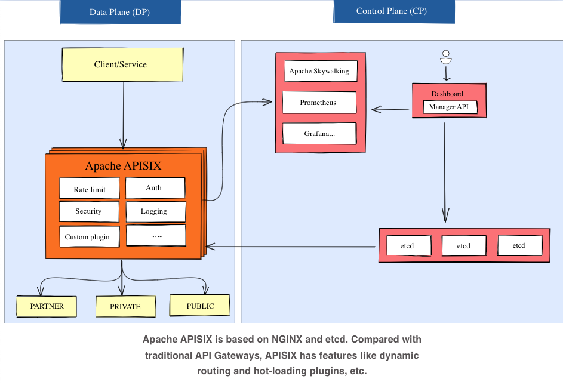
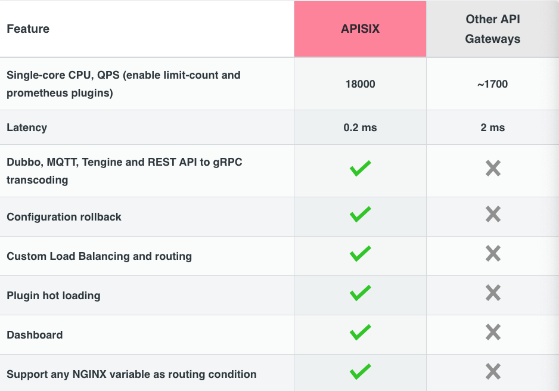

# Apache APISIX

API Gateway & AI Gateway for APIs & AI Agents

Provee funcionalidades de manejo de tráfico

- Load Balancing
- Dynamic Upstream
- Canary Release
- Circuit Breaking
- Auth
- Observability
- Open-Source Plugins
- Throteling
  

- Performance
  - Implementado para ser performante con la mínima latencia posible
- Seguridad
  - Protegido contra ataques con multiples plugins
    - API verification
    - CORS
    - JWT
    - Key Auth
    - OpenID Connect (OIDC)
    - Keycloak
- Escalabilidad y disponibilidad
  - Permite crear plugins propios
  - Custom Load Balancing Algorithms
- Fully dynamic
  - Provee Hot updates y Hot plugins
    - Updates continuos sin reiniciar
- Multi-platform and protocol
  - Agnostico al vendor
  - Corre desde bare-metal hasta Kubernetes
  

----

## Fuentes

- https://apisix.apache.org/
- https://apisix.apache.org/docs/apisix/getting-started/README/
- https://youtu.be/9SAIubzbgi8?si=nBRvo4tIgq6HRLyl